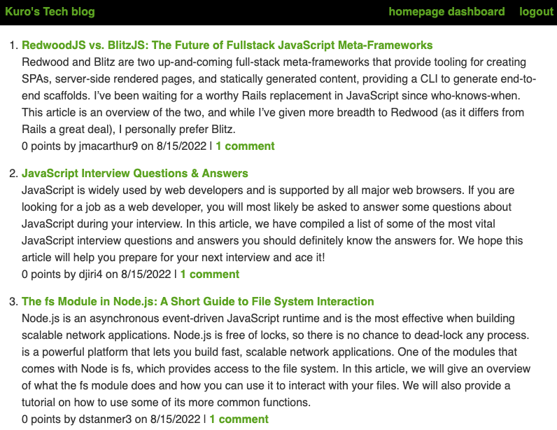
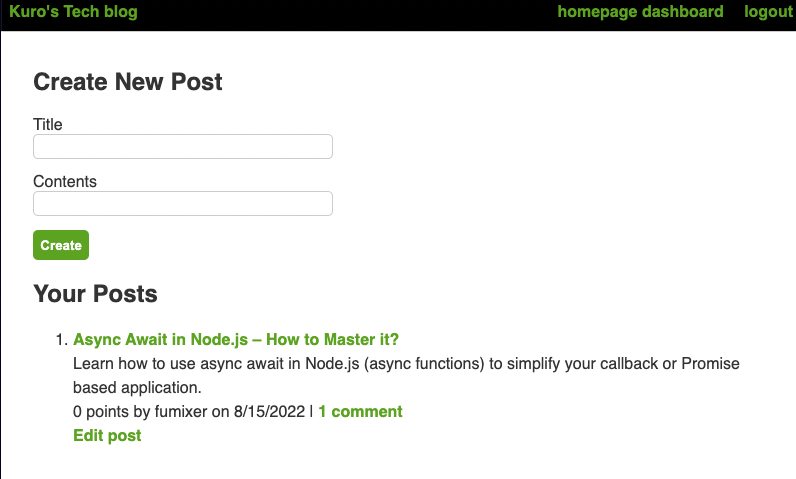

# tech-blog

This is a CMS-style blog application using node.js and handlebars.

### Github : https://github.com/fumixer/tech-blog

### Deployed link: https://evening-journey-51361.herokuapp.com/

### Screenshot

### Technologies

* node.js
* npm
* dotenv
* express
* mysql2
* sequelize
* handlebars

test test test

